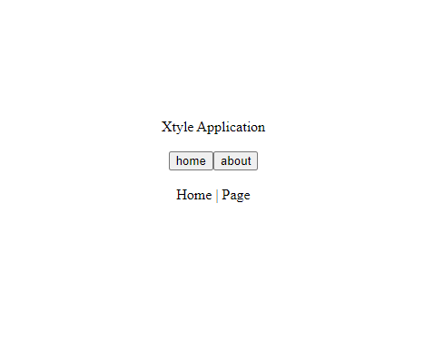

# **Xtyle** | Application

!!! tip "Views"

    Create **Views** with your **Components**

## Browser Usage

```html
<script src="https://unpkg.com/xtyle@latest"></script>
```

<p align="center" style="font-size: 2.5em; letter-spacing: -2px; font-family: Georgia, sans-serif;" >
   Xtyle App 
</p>



## Demo | **HTML**

```html
<!DOCTYPE html>
<html lang="en">
  <head>
    <meta charset="UTF-8" />
    <meta name="viewport" content="width=device-width, initial-scale=1.0" />
    <!-- Config -->
    <title>Xtyle App</title>
    <!-- Xtyle JS -->
    <script src="https://unpkg.com/xtyle@latest"></script>
  </head>
  <body>
    <div id="app"></div>

    <!-- Xtyle Code -->
    <script>
      // Home Page
      const pageHome = {
        slot: {
          default() {
            const { $route, $router } = this;
            const current = $router.args.name || "home";
            const pageName = current.charAt(0).toUpperCase() + current.slice(1);
            return pageName + " | Page";
          },
        },
      };

      // App Component
      const App = {
        slot: {
          default() {
            const { $route, $router } = this;
            return [
              "div",
              {
                style: "text-align: center;",
              },
              [
                "Xtyle Application",
                ["br", {}, []],
                ["br", {}, []],
                [
                  "button",
                  {
                    "x-on:click": () => {
                      $router.go("/");
                    },
                  },
                  ["home"],
                ],
                [
                  "button",
                  {
                    "x-on:click": () => {
                      $router.go("/about");
                    },
                  },
                  ["about"],
                ],
                ["br", {}, []],
                ["br", {}, []],
                $route,
              ],
            ];
          },
        },
      };

      // Xtyle App
      const app = xtyle.app({
        app: App,
        routes: {
          "/": pageHome,
          "/{name}": pageHome,
        },
      });

      // Mount
      app.mount("#app");
    </script>
  </body>
</html>
```
