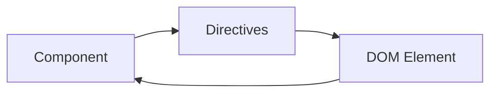

!!! info "Description"

    **Directives** are a powerful tool that allows developers to reuse and encapsulate logic in their code. By leveraging custom directives, developers can effectively separate and encapsulate complex logic and low-level DOM operations, resulting in more modular and maintainable code. These directives enable the reuse of specific functionalities across multiple elements or components, promoting code consistency and reducing duplication.

    Custom directives provide a flexible and reusable approach to address unique requirements in web development. They can be used for a variety of purposes, such as applying specialized behaviors, manipulating the DOM, or implementing custom event handling. With custom directives, developers have the ability to create highly adaptable and reusable solutions that cater to specific needs.



## Properties

- **`props`** Arguments in **camelCase format**.
- **`self`** Arguments that construct the **Component**.

| Key                     | Description                               |
| ----------------------- | ----------------------------------------- |
| **`self.ref.add`**      | **Add** class(es) to the DOM element      |
| **`self.ref.remove`**   | **Remove** class(es) to the DOM element   |
| **`self.ref.toggle`**   | **Toggle** class(es) to the DOM element   |
| **`self.ref.contains`** | Check if DOM element **Contains** a class |

## Example

```js
const Config = {
  directives: {
    demo: (self, props) => {
      // Self
      preact.useEffect(() => {
        self.ref.add("add-class-after-init");
        self.ref.remove("add-class-after-init");
        self.ref.toggle(["toggled-class"], true);
        self.ref.contains("toggled-class");
      }, []);

      // Props
      console.log(props);
    },
  },
  // Other Configs . . .
};
```
