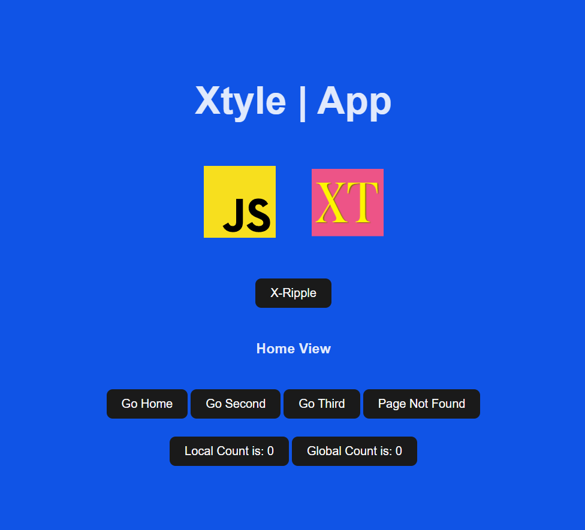

Here you will learn how to use this library with **`JSX`** and **`Vite`**.

[**Click Here**](https://github.com/hlop3z/xtyle/releases/download/jsx-template/xtyle-jsx.zip) to Download the template.

Is just a simple **`vite`** template with the configurations to transform **`JSX`** into **`Xtyle` Code**

**After downloading** and **`unzipping`** just run the following code inside the folder:

## Installation

```sh
npm install
npm run dev
```



## Demo | **Application**

!!! note

        It comes with four (4) parts. (**`App`, `View`, `Button`, `Page Name`**)

=== "App"

      Application

      ```js title="./src/App.jsx"
      import javascriptLogo from "./assets/logos/javascript.svg";
      import xtyleLogo from "./assets/logos/xtyle.svg";

      export default {
        slot: {
          default() {
            const { $route, $router } = this;
            if ($router.route === "404") {
              return $route;
            }
            return (
              <div id="app">
                <h1>Xtyle | App</h1>
                <a
                  href="https://developer.mozilla.org/en-US/docs/Web/JavaScript"
                  target="_blank"
                >
                  
                </a>
                <a href="https://hlop3z.github.io/xtyle/" target="_blank">
                  
                </a>
                {$route}
              </div>
            );
          },
        },
      };
      ```

=== "View"

      View

      ```js title="./src/views/sample.jsx"
      import components from "../components";

      const { pageName, xButton } = components;

      export default {
        tag: "div",
        slot: {
          default() {
            const { $router } = this;
            return (
              <div>
                {pageName()}
                <br />
                <button x-ripple x-on:click={() => $router.go("/")}>
                  Go Home
                </button>
                <button x-on:click={() => $router.go("/2nd")}>Go Second</button>
                <button x-on:click={() => $router.go("/3rd")}>Go Third</button>
                <button
                  x-on:click={() =>
                    $router.go("/not/found/" + new Date().toISOString())
                  }
                >
                  Page Not Found
                </button>
                <br />
                <br />
                {xButton({ isGlobal: false })}
                {xButton({ isGlobal: true })}
              </div>
            );
          },
        },
      };
      ```

=== "Button"

      Component (Button)

      ```js title="./src/components/x/button.jsx"
      export default {
        tag: "h3",
        slot: {
          default() {
            const { $router } = this;
            const current = $router.args.name || "home";
            const pageName = current.charAt(0).toUpperCase() + current.slice(1);
            return pageName + " View";
          },
        },
      };
      ```

=== "Page Name"

      Component (Page Name)

      ```js title="./src/components/page-name.jsx"
      export default {
        tag: "button",
        follow: ["counter"],
        props: {
          isGlobal: false,
        },
        data: {
          count: 0,
        },
        attrs: {
          "x-on:click": (vnode, event) => {
            const { isGlobal } = vnode.state;
            const { counter } = vnode.$ui.val;
            if (isGlobal) {
              counter.state = (draft) => {
                draft.count += 1;
              };
            } else {
              vnode.state = (draft) => {
                draft.count += 1;
              };
            }
            console.log(event);
          },
        },
        slot: {
          default() {
            const { isGlobal } = this.state;
            if (isGlobal) {
              const { counter } = this.$ui.val;
              const { count } = counter.state;
              return "Global Count is: " + count;
            }
            const { count } = this.state;
            return "Local Count is: " + count;
          },
        },
      };
      ```
