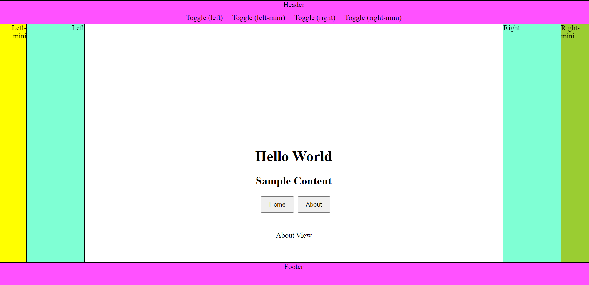

!!! info "Description"

    With the (**Xtyle** + **Preact**) **Starter Template**, developers can jumpstart their projects with a preconfigured environment that includes all the necessary setup and dependencies. It offers a streamlined development experience, allowing developers to focus on building their application's core functionality without worrying about the initial setup.

    The template can be easily downloaded and used as a foundation for a wide range of web projects. Whether you are starting a small personal website or developing a complex web application, the (**Xtyle** + **Preact**) Starter Template provides a robust starting point that combines the power of Xtyle and the flexibility of Preact.

## TypeScript **Template**

!!! tip "Download Template"

    [Click here to Download](https://github.com/hlop3z/xtyle/raw/main/getting-started/xtyle-ts-template.zip)

    ```sh
    unzip xtyle-ts-template.zip
    ```

<div id="terminal-index" data-termynal></div>


